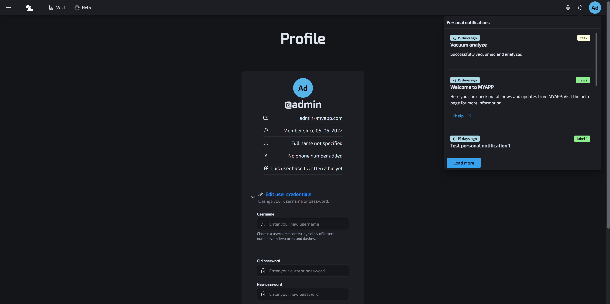
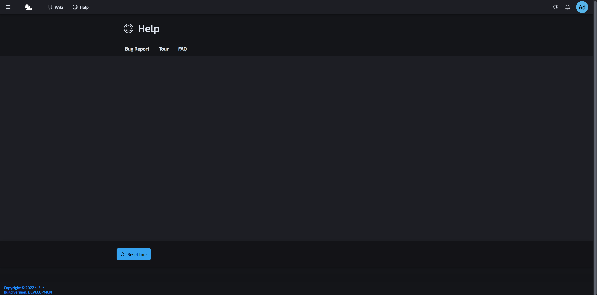
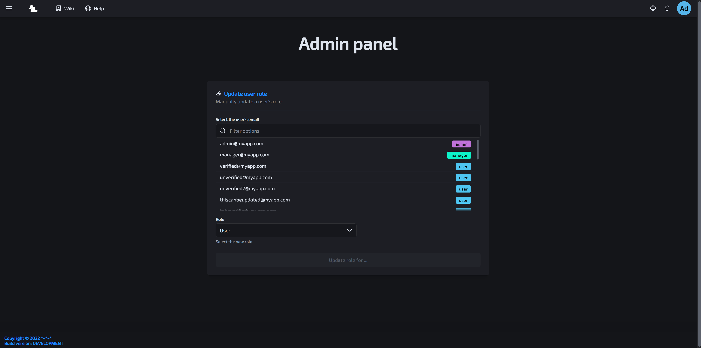
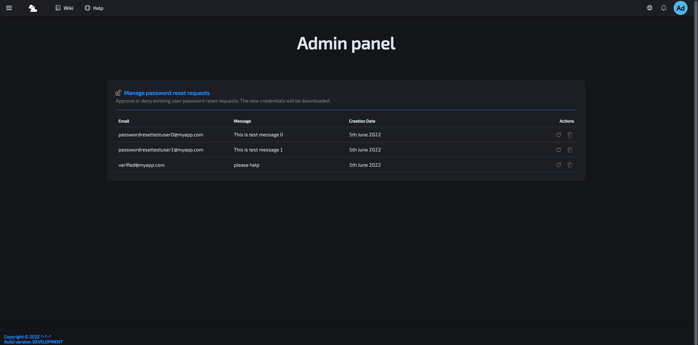
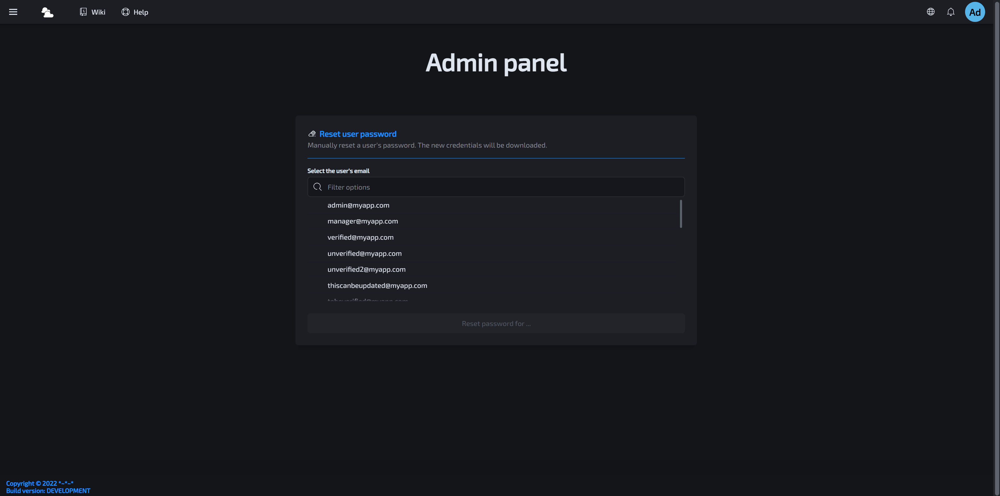
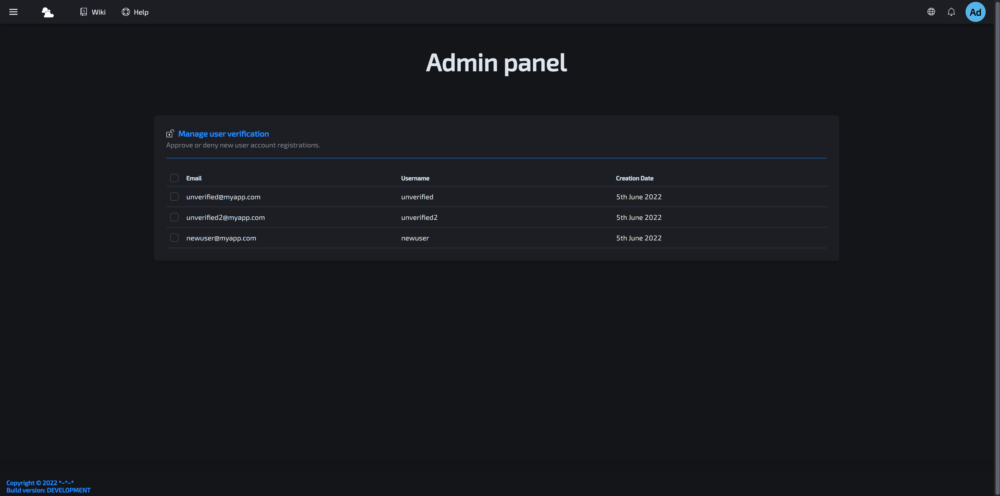
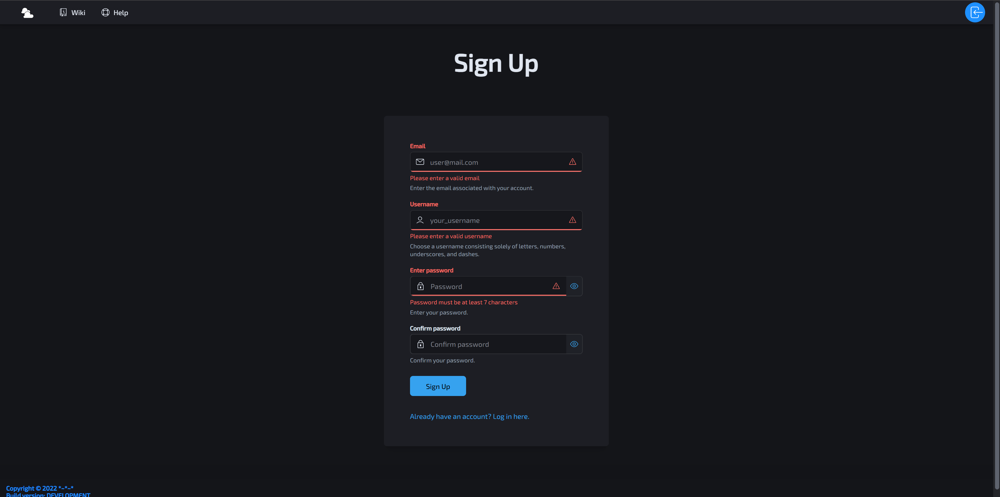
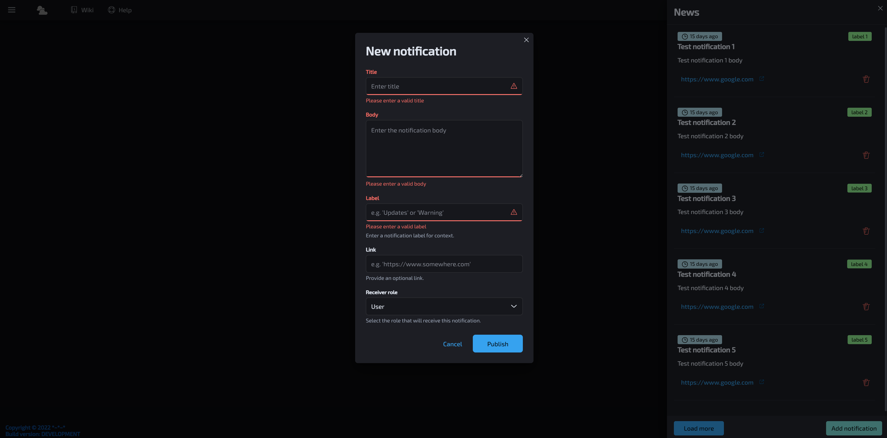

# FastAPI-React-Postgres-Docker-Traefik-template

[](https://dev.azure.com/danicc097/devops-tests/_build/latest?definitionId=5&branchName=dev) 

<p align="center">
  <div>
    
    
  </div>
  <div>
    
    
  </div>
  <div>
    
    
  </div>
  <div>
    
    
  </div>
</p>


## Table of contents  <!-- omit in toc -->

- [FastAPI-React-Postgres-Docker-Traefik-template](#fastapi-react-postgres-docker-traefik-template)
  - [Dev setup](#dev-setup)
    - [Root dir setup](#root-dir-setup)
    - [Backend dev setup](#backend-dev-setup)
    - [Frontend dev setup](#frontend-dev-setup)
    - [E2E dev setup](#e2e-dev-setup)
    - [Run E2E tests](#run-e2e-tests)
    - [Traefik setup](#traefik-setup)
  - [Azure pipelines](#azure-pipelines)
  - [Troubleshooting](#troubleshooting)
    - [Pydantic validation](#pydantic-validation)
    - [Traefik](#traefik)

## Dev setup

### Root dir setup

Create and fill in ``.env``, ``.env.dev`` and ``.env.prod`` from ``.env.template``.

### Backend dev setup

Run the installation scripts in ``/docs``.

Create ``.env.dev`` and ``.env.prod`` from ``.env.template``.

### Frontend dev setup

```bash
cd frontend && pnpm i
```

Create ``.env.development`` and ``.env.production`` from ``.env.template``.

### E2E dev setup

```bash
cd e2e && npm install
```

### Run E2E tests

This will setup dev environment normally but run the tests in a bundled frontend.

```bash
bin/run-e2e-tests
```

### Traefik setup

Create certificates with ``mkcert``.

For ``linux`` VM:
```bash
mkdir traefik/certificates
cd traefik/certificates
sudo apt install libnss3-tools
wget https://github.com/FiloSottile/mkcert/releases/download/v1.4.3/mkcert-v1.4.3-linux-amd64 -O mkcert
chmod +x mkcert
sudo mv mkcert /usr/bin/
source ~/.bashrc
mkcert --cert-file localhost.pem --key-file localhost-key.pem  "dev.localhost" "*.dev.localhost" "prod.localhost" "*.prod.localhost" "e2e.localhost" "*.e2e.localhost" "e2e.localhost" "*.e2e.localhost" "wiki.localhost"
mkcert --install
```

For ``Windows``:
Copy the CAROOT from the virtualmachine:
`cat "$(mkcert -CAROOT)/rootCA.pem"`
over to windows:
`code "$(.\mkcert.exe -CAROOT)/rootCA.pem"`

Run `mkcert --install` for the first time to create a CAROOT. Then replace the contents and run `mkcert -install` again to update the CAROOT.

## Azure pipelines

- Variables named "\*secret\*" in ``.env*`` files are ignored, and ``SECRET_KEY=something`` in ``variables:`` key won't be parsed either and yield ``SECRET_KEY=``. They have to be set in Azure Devops and mapped in pipeline tasks with the ``env:`` key.

- If ``ENV_VAR`` is set as an azure pipeline variable at the top level, it's available as ``${ENV_VAR}`` in compose.

## Troubleshooting

### Pydantic validation

Fastapi won't give a meaningful error when the response model typing in a route does not match the return value.
```py
    if errors:
    >               raise ValidationError(errors, field.type_)
    E               pydantic.error_wrappers.ValidationError: <unprintable ValidationError object>

/usr/local/lib/python3.9/site-packages/fastapi/routing.py:138: ValidationError
```

We should always look into the ``response_model`` of the route first of all to ensure it's correct.

### Traefik

- Ensure different routers ``traefik.http.routers.<my-router>`` are used for different environments. Else we get a 404 when the service container is actually running
